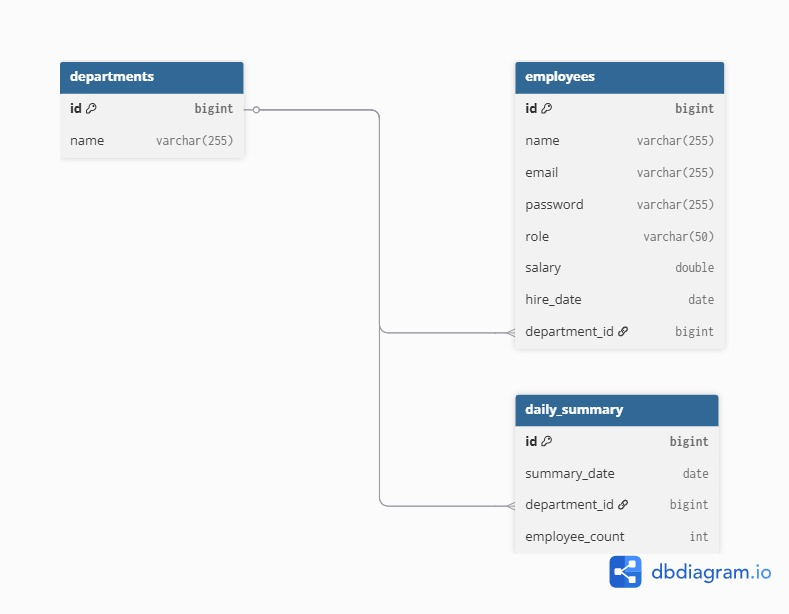

 SCB Assignment: Employee Management System

This repository contains a backend Employee Management System built with Spring Boot. It demonstrates a production-aware architecture, including role-based security, a version-controlled database schema, and automated tasks.

---
 Core Features

    Security: JWT-based authentication and authorization with `ADMIN` and `USER` roles.
   Data Persistence: Spring Data JPA with a Flyway-managed H2 database schema.
   Automated Reporting: A daily scheduled job generates departmental employee summaries.
   Containerization: Fully containerized with Docker for consistent and isolated deployment.
   Testing: Comprehensive unit test coverage for all service-layer business logic.
   API Documentation: A complete Postman collection is provided for API interaction.

---

### Getting Started

 Prerequisites

*   Java JDK 17+ (developed with 21)
*   Apache Maven 3.9+
*   Docker Desktop (for containerized deployment)

 Running the Application

There are two ways to run the application:

1. Using Docker (Recommended)

This is the simplest way to run the application, as it requires no local Java or Maven setup.

1.  Navigate to the `docker` directory.
2.  Execute the following command:
    ```bash
    docker-compose up --build -d
    ```
3.  The application will be available at `http://localhost:8080/api`. To view logs, run `docker logs -f scb-assignment`.
4.  
**2. Using Maven**

1.  Ensure your `JAVA_HOME` is correctly set to a compatible JDK.
2.  From the project root, run the application using the Maven wrapper:
    ```bash
    mvn spring-boot:run
    ```
3.  The application will be available at `http://localhost:8080/api`.

---

Project Documentation & Assets

This repository includes key design and testing artifacts to facilitate review.

#### 1. Database Schema (ERD)

The Entity-Relationship Diagram (ERD) provides a visual overview of the database structure.

*   **File Location:** `docs/ERD/ERD.jpeg`
*   **Live Database Console:** While the application is running, the H2 database console is available at `/h2-console` for live data inspection.



#### 2. API Testing (Postman Collection)

A Postman collection with pre-configured requests for all endpoints is included.

*   **File Location:** `docs/api/SCBANK postman collection with examples.postman_collection.json`

**How to Use:**

1.  **Import:** Open Postman and import the collection file.
2.  **Authenticate:**
    *   Run the `POST /auth/login` request with valid credentials (e.g., `Ahmed@test.com` / `password`).
    *   A test script will automatically capture the returned JWT and set it as an environment variable for subsequent requests.
3.  **Explore:** You can now execute any other request in the collection, as they will automatically include the required authentication token.

---

### Technical Details

#### Project Structure

The codebase is organized into a standard layered architecture:

*   `src/main/java/com/scb/application/controller`: REST API endpoints.
*   `src/main/java/com/scb/application/service`: Business logic and orchestration.
*   `src/main/java/com/scb/application/repository`: Data access layer using Spring Data JPA.
*   `src/main/java/com/scb/application/entity`: JPA entity definitions.
*   `src/main/resources/db/migration`: Version-controlled database schema scripts (Flyway).
*   `src/test/java`: Unit tests for the service layer.

#### Configuration

Key application properties are managed via environment variables to avoid hardcoding secrets.

*   `JWT_SECRET`: The secret key for signing JWTs.
*   `DEFAULT_EMPLOYEE_PASSWORD`: The initial password for users created via Flyway's seed script.

#### Testing

The project is configured with a suite of unit tests for the service layer. To run them, execute:

```bash
mvn test
```

---

### Future Enhancements

*   **Pagination:** Implement pagination for endpoints that return lists (`/employees`, `/departments`).
*   **Refactor to `java.time`:** Migrate from `java.util.Date` to the modern `java.time` API (`LocalDate`, `Instant`) in entities.
*   **Automate DTO Mapping:** Integrate a library like MapStruct to reduce boilerplate mapping code.
*   **Monitoring:** Add Spring Boot Actuator to expose health, metrics, and other operational endpoints.
```
